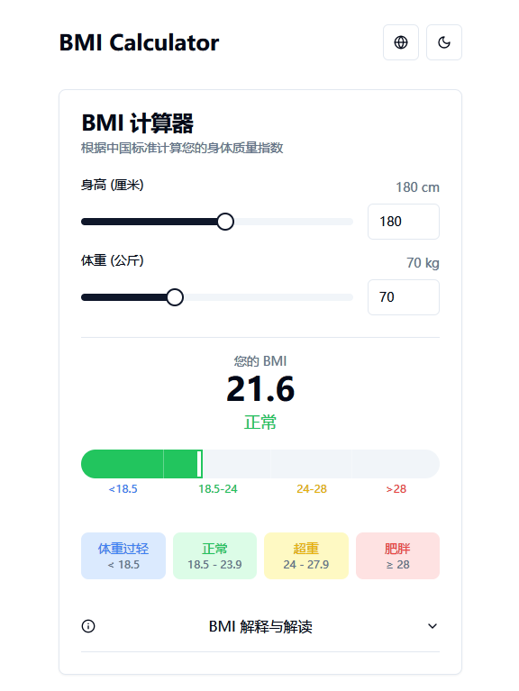
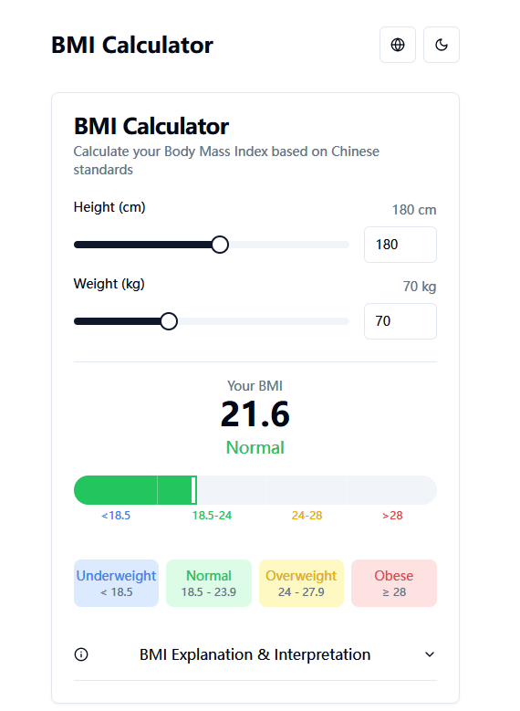

# 实时 BMI 计算器

<!-- Chinese Badges -->
<p align="center">
  <a href="https://github.com/fangyuan99/real-time-bmi-calculator/stargazers"></a>
  
  
  
  
  
  
  
</p>

[English](#english-version)


> 目前市面上缺乏支持实时计算 BMI 并能便捷查看达到自己健康 BMI 范围对应体重的工具，因此我开发了这个项目来填补这一空白。

一个使用 Next.js (React) 构建的简单 Web 应用，根据用户输入的身高和体重实时计算身体质量指数 (BMI)。




## ✨ 功能

*   **实时计算:** 在您输入身高和体重时即时计算 BMI。
*   **BMI 分类:** 清晰显示 BMI 所属分类（例如：体重过轻、正常、超重、肥胖）。
*   **响应式设计:** 使用 Tailwind CSS 适配不同屏幕尺寸。

## 🛠️ 技术栈

*   [React](https://react.dev/)
*   [Next.js](https://nextjs.org/)
*   [Tailwind CSS](https://tailwindcss.com/)
*   [TypeScript](https://www.typescriptlang.org/)
*   [Radix UI](https://www.radix-ui.com/)
*   [pnpm](https://pnpm.io/) (包管理器)
*   [Node.js](https://nodejs.org/) (运行环境)

## 🚀 快速开始

1.  **克隆仓库:**
    ```bash
    git clone https://github.com/your-username/real-time-bmi-calculator.git
    ```
2.  **进入项目目录:**
    ```bash
    cd real-time-bmi-calculator
    ```
3.  **安装依赖:**
    ```bash
    pnpm install
    ```
4.  **启动开发服务器:**
    ```bash
    pnpm run dev
    ```
5.  在浏览器中打开 `http://localhost:3000` (Next.js 默认端口)。

## 📖 使用方法

*   在指定输入框中输入您的身高。
*   在指定输入框中输入您的体重。
*   *(如果适用)* 选择所需的单位（公制或英制）。
*   计算出的 BMI 和相应的分类将自动显示。

---

## English Version <a name="english-version"></a>

# Real-time BMI Calculator

<!-- English Badges -->
<p align="center">
  <a href="https://github.com/fangyuan99/real-time-bmi-calculator/stargazers"></a>
  
  
  
  
  
  
  
</p>

> Existing tools on the market often lack real-time BMI calculation and the ability to easily see the weight range corresponding to a healthy BMI. Therefore, I developed this project to fill that gap.

A simple web application built with Next.js (React) to calculate Body Mass Index (BMI) in real-time based on user input for height and weight.




## ✨ Features

*   **Real-time Calculation:** BMI is calculated instantly as you type your height and weight.
*   **BMI Categories:** Clearly indicates the BMI category (e.g., Underweight, Normal, Overweight, Obese).
*   **Responsive Design:** Adapts to different screen sizes using Tailwind CSS.

## 🛠️ Tech Stack

*   [React](https://react.dev/)
*   [Next.js](https://nextjs.org/)
*   [Tailwind CSS](https://tailwindcss.com/)
*   [TypeScript](https://www.typescriptlang.org/)
*   [Radix UI](https://www.radix-ui.com/)
*   [pnpm](https://pnpm.io/) (Package Manager)
*   [Node.js](https://nodejs.org/) (Runtime Environment)

## 🚀 Getting Started

1.  **Clone the repository:**
    ```bash
    git clone https://github.com/your-username/real-time-bmi-calculator.git
    ```
2.  **Navigate to the project directory:**
    ```bash
    cd real-time-bmi-calculator
    ```
3.  **Install dependencies:**
    ```bash
    pnpm install
    ```
4.  **Start the development server:**
    ```bash
    pnpm run dev
    ```
5.  Open your browser to `http://localhost:3000` (Next.js default port).

## 📖 Usage

*   Enter your height in the designated input field.
*   Enter your weight in the designated input field.
*   *(If applicable)* Select the desired units (metric or imperial).
*   The calculated BMI and corresponding category will be displayed automatically.


